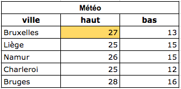

# MySQL et les base de données

## Objectifs de ce parcours SQL

- Comprendre ce qu'est une base de données et à quoi cela sert.
- Maîtriser la syntaxe SQL.
- Pouvoir concevoir et mettre en place une base de données dans un projet concret.

## Utilité des bases de données

Pour stocker les informations de manière permanente, on peut utiliser un fichier json. Or, pour lire ou écrire dans un fichier, le serveur web doit à chaque fois l'ouvrir, puis le lire ou écrire dedans, puis le refermer.
Prenons l'example d'une todolist:

- **Problème 1 : si le nombre d'accès simultanés augmente** : imagine qu'une todolist est utilisée par 200 personnes en même temps: lorsqu'une tâche est ajoutée à la liste ( donc au fichier `json`) le processus lancé par le premier utilisateur monopolise le fichier: les 199 autres processus (correspondant aux autres utilisateurs) doivent patienter, chacun à leur tour, que le fichier soit libéré par le processus en cours. Un peu comme à la boucherie, ou à la Poste. 
- Par conséquent, il est fort à parier qu'au delà de cinq ou six utilisateurs simultanés, cela crée une telle latence que les autres utilisateurs reçoivent des erreurs de type "time out" (signifiant que la requête HTTP n'a pas abouti à une réponse valide).

- **Problème 2 : si le contenu augmente** : au fur et à mesure que la liste de tâche augmente, le fichier gonfle en poids (kilobytes). L'opération d'ouverture, écriture, fermeture du fichier sera donc de plus en plus lente.

Face à ces limites, la solution actuelle est d'associer au serveur web et à l'exécutable PHP un autre serveur: un serveur de bases de données. Son rôle dans l'architecture LAMP est précis: stocker des données, et permettre d'interragir avec ces données en les servant très (très) rapidement à PHP, ce qui minimise les risques de "timeout".

_Pour la petite histoire, il va très vite parce que le serveur SQL met les données dans la RAM de l'ordinateur hébergeant le serveur. Et cela veut dire quoi RAM ? Yep : "Rapid Access Memory". Comme il est en mémoire, pas besoin d'ouvrir ou fermer des fichiers sur un disque dur, typiquement plus lent._

## Les bases de données sont partout

Les bases de données (ou "db" pour faire court) sont parfaites pour **manipuler rapidement une grande quantité de données**. C'est pour cela que Facebook, Google, Pinterest, airbnb.com, gmail, google drive, tous les sites utilisant un CMS comme WordPress ou Joomla... utilisent des bases de données.

## Les DBMS (Database Management Systems)

Il existe de nombreux logiciels permettant de manipuler des bases de données, appelés des "moteurs de gestion de bases de données. En anglais et en bref: DBMS.

Pour le web, on utilise principalement ceux-ci:

- MySQL (et sa version recommandée : MariaDB)
- SQLite
- PostgreSQL
- MongoDB

MySQL étant très populaire et présent sur 99.99% des hébergeurs, c'est lui que nous utiliserons durant cette séquence. Ce qui est cool, c'est que le langage pour interagir avec MySQL est le SQL, qui est également utilisé par les autres DBMS. Du coup ce que tu apprends avec MySQL est transposable facilement si tu devais en utiliser un autre.

## A quoi ressemble une base de données ?

Une **base de données** n'est en fait qu'un groupe d'une ou plusieurs tables contenant... des données. Un peu comme un tableau Excel ou Google sheets. Voici une base de données ne contenant qu'une seule table : "météo".

Dans cet exemple, la **table** "météo" contient les données permettant de présenter les prévisions météos des grandes villes belges (température minimum et maximum).

Chaque ville a sa propre **rangée** (en anglais : _row_).

Chaque rangée (donc, ici, ville) est décrite par autant de **colonnes** que nécessaire par l'application (en anglais : _column_).

La donnée en elle-même se trouve dans une **cellule** (en anglais : _cell_).

**Vérifie bien qu'à ce stade, tu comprennes et saches utiliser à bon escient ces termes : _base de données_, _table_, _rangée_, _colonne_, _cellule_.**

## La syntaxe SQL

Il nous reste à présent à te familiariser avec la syntaxe SQL pour que tu puisses poursuivre ta quête des super-pouvoirs de développeur web.

Une fois ta DB créée, ton application effectuera essentiellement 4 types d'opération, qu'on résume par "**CRUD**", autrement dit:

1. **C**reate : ajouter une rangée à ta table.
2. **R**ead : sélectionner une ou plusieurs rangées (pour les afficher par exemple).
3. **U**pdate : modifier l'information stockée sur une rangée.
4. **D**elete : effacer une rangée.

### Séquences

Pour te faciliter l'apprentissage, tu ne dois rien installer à ce stade. On va utiliser le site <http://sqlbolt.com> pour que tu ne doives te concentrer que sur la compréhension et l'acquisition de la syntaxe SQL.

Pour découvrir la syntaxe SQL, suis à présent ces leçons, dans cet ordre.

1. Intro : [Intro](https://sqlbolt.com/)
1. Read : [SELECT](https://sqlbolt.com/lesson/select_queries_introduction) Lesson 1 to 12
1. Create : [INSERT INTO](https://sqlbolt.com/lesson/inserting_rows)
1. Update : [UPDATE](https://sqlbolt.com/lesson/updating_rows)
1. Delete : [DELETE FROM](https://sqlbolt.com/lesson/deleting_rows)
1. [CREATE DB](https://sqlbolt.com/lesson/creating_tables)
1. [UPDATE DB](https://sqlbolt.com/lesson/altering_tables)
1. [DROP DB](https://sqlbolt.com/lesson/dropping_tables)

T'as tout compris ? [Passe à la suite](./2.moveon.md)
T'es pas sur ? Vérifie via ce [quizz SQL de la W3School](https://www.w3schools.com/quiztest/quiztest.asp?qtest=SQL)
Evalue tes lacunes, n'hésite pas à refaire les parties plus compliquées.

---

## Besoin d'aide ?

- Essaye de ne pas regarder la solution, si tu le fait soit bien sur de la comprendre, efface la et refait la de tête ou en t'aidant de google.
- Formate tes recherches sur google ainsi : "_mysql how to ..._ ". Oui, en anglais, car Napoléon a perdu à Waterloo.
- Forums et endroits où chercher et poser tes questions : [https://dba.stackexchange.com](https://dba.stackexchange.com)
- Le look de [SQLCourse.com](http://www.sqlcourse.com/intro.html) est vieillot, mais son contenu est très bien expliqué et permet d'aller en détail.

